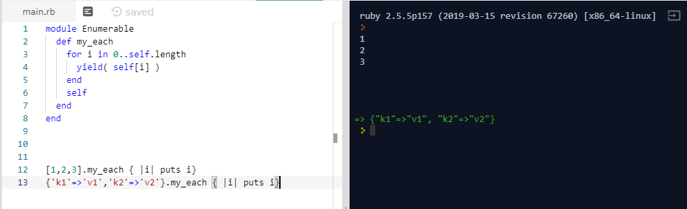

# Enumerable Methods
> Project to re-build a few built-in methods of Ruby Language.

 Methods based on Enumerable package. 
Original version on [Enumerable](https://ruby-doc.org/core-2.7.0/Enumerable.html)
and [Array](https://ruby-doc.org/core-2.4.1/Array.html#method-i-each)

## Content

* [Requirements](#requirements)
* [Built With](#built-with)
* [Live Demo](#live-demo)
* [Getting Started](#getting-started)
* [Dependencies](#dependencies)
* [Contributing](#contributing)
* [Acknowledgments](#acknowledgments)
* [Author](#author)
* [License](#license)

## Requirements

<ul>
  <h3>Re-make this methods of Enumerate module:</h3>
  <li>[x] my_each</li>
  <li>[x] my_each_with_index</li>
  <li>[checkbox:unchecked] my_select (Filter like)</li>
  <li>[checkbox:unchecked] my_all?</li>
  <li>[checkbox:unchecked] my_any?</li>
  <li>[checkbox:unchecked] my_none?</li>
  <li>[checkbox:unchecked] my_count</li>
  <li>[checkbox:unchecked] my_map</li>
  <li>[checkbox:unchecked] my_inject (Reduce like)</li>
</ul>

<ul>
  <h3>Extends</h3>
  <li>[checkbox:unchecked] Test inject with #multiply_els</li>
  <li>[checkbox:unchecked] Extends #my_map</li>
</ul>

### Built With

- Ruby Language  
- Rubocop (Linter) with Stickler CI 
- Git, Github and VScode  

## Live Demo

[Live Demo Link](https://repl.it/@ThiagoMiranda2/enumerables)

## Getting Started

To get a local copy up and running follow these steps.

### Dependencies

Ruby 2.5.5

### Contributing

Contributions, issues and feature requests are welcome!

Feel free to check the [issues page](issues/).

### Acknowledgments

- A special thanks for the code reviewers.

## Author

👤 **Thiago Miranda**

- Github: [@SevlaMare](https://github.com/SevlaMare)
- Twitter: [#SevlaMare)](https://twitter.com/SevlaMare)
- Linkedin: [SevlaMare)](https://www.linkedin.com/in/sevlamare)

### License

<strong>Creative Commons</strong>